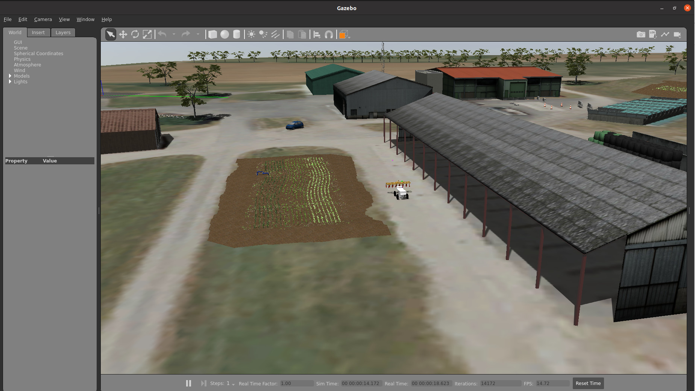
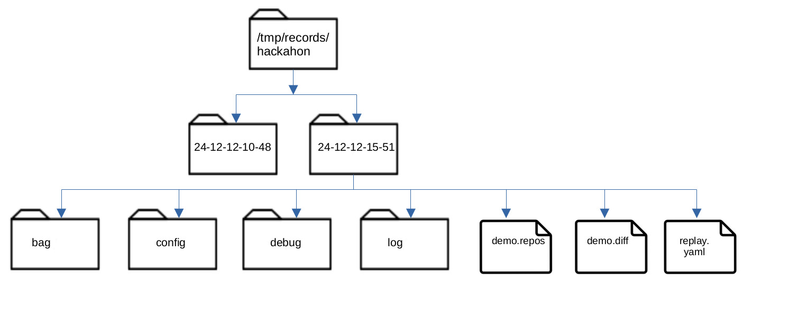

# Hackathon configuration

In the hackathon configuration directory, you will find two subdirectories (`robot` and `path`) and three main files: `records.yaml`, `simulation.yaml`, and `wgs84_anchor.yaml`. The `robot` directory contains the [configuration details](robot_configuration.md) for the robot, including specifications for the mobile base, onboard sensors, tools, as well as localization and path-following algorithms provided by INRAE. The `path` directory holds predefined trajectories for the path following algorithm.

#### Simulation configuration:

For the hackathon, the **Gazebo** simulator was selected for the qualification phase. The configuration file `simulation.yaml` allows you to specify the virtual world where the competition takes place. In this case (see below), the selected world is located in the `world` directory of the ROS 2 package `hackathon_bringup` and is named `demo.world`:

```yaml
world_package: hackathon_bringup
world_name: demo.world
```



#### WGS84 anchor configuration:

The `wgs84_anchor.yaml` file (see below) defines the geodetic reference coordinates for the challenge. This reference point serves two main purposes: 1) it enables the simulator to generate NMEA frames from the GPS plugin (see the `romea_gps_plugin` ROS2 package), and 2) it allows the localization algorithm to transform GPS data within an ENU frame.

```yaml
latitude: 46.339159
longitude: 3.433923
altitude: 278.142
```

#### Records configuration

The `records.yaml` file configures the recording options. It allows you to specify the directory where the data will be saved (e.g., `/tmp/records/hackathon`) and its contents (see below). In addition to the ROS 2 bag, it is possible to record debug information, logs, configurations, and code versions with their differences.  

```yaml
directory: /tmp/records
config: true
debug: true
log: true
vcs: true
```

For each recording, a new directory is created with a name based on the date and time when the demo is launched. To replay the recorded data, you can use the following command:

```bash
docker compose run --rm bash ros2 launch tirrex_demo replay.launch.py    replay_directory:=/tmp/records/hackathon/24-12-12-15-51 use_recorded_config:=true 
```


